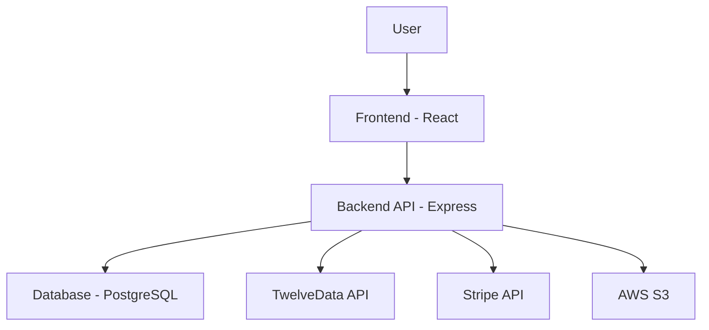

# FlowdeX Architecture

This document explains how all the components of the FlowdeX application work together to create a fully functional SaaS trading journal and backtesting platform.

## System Overview

FlowdeX is built using a modern tech stack:

- **Frontend**: React.js with TypeScript
- **Backend**: Node.js with Express.js
- **Database**: PostgreSQL with Drizzle ORM
- **Authentication**: Custom implementation with session management
- **External Services**: 
  - TwelveData for market data
  - Stripe for payments
  - AWS S3 for file storage

## Architecture Diagram

## Core Components

### 1. Database Layer

The database layer uses PostgreSQL with Drizzle ORM for type-safe database operations.

**Key Entities**:
- Users: Store user account information
- Trading Sessions: Backtesting sessions with parameters
- Trades: Individual trade records
- Journal Entries: Trade analysis and notes

**Connection Flow**:
1. Application reads `DATABASE_URL` from environment variables
2. Drizzle ORM creates a connection pool
3. All database operations use the Drizzle query builder
4. Schema is defined in `shared/schema.ts` and synchronized with the database

### 2. Authentication System

FlowdeX implements a dual authentication system:
- Local development authentication for testing
- Replit authentication for production deployment

**Authentication Flow**:
1. User requests authentication
2. Middleware validates session
3. User data is retrieved from the database
4. Protected routes check authentication status

### 3. TwelveData Integration

TwelveData provides market data for charting and analysis.

**Integration Flow**:
1. Frontend requests chart data through `/api/chart-data`
2. Backend checks for API key
3. If key exists, calls TwelveData API
4. If no key, returns mock data for development
5. Data is formatted and sent to frontend

**Key Endpoints**:
- `/api/chart-data`: Historical price data
- `/api/price`: Current price data

### 4. Stripe Integration

Stripe handles subscription payments for the SaaS model.

**Integration Flow**:
1. User selects a subscription plan
2. Frontend requests subscription creation
3. Backend creates Stripe customer and subscription
4. Payment is processed through Stripe
5. Subscription status is stored in the database

**Key Endpoints**:
- `/api/subscription/plans`: Get available plans
- `/api/subscription`: Create a new subscription
- `/api/subscription/:id`: Cancel a subscription

### 5. AWS S3 Integration

AWS S3 stores user files like trade screenshots.

**Integration Flow**:
1. User requests file upload
2. Backend generates presigned URL for direct upload
3. Frontend uploads file directly to S3
4. File metadata is stored in the database

**Key Endpoints**:
- `/api/file-upload-url`: Generate upload URL
- `/api/file-download-url`: Generate download URL

## Data Flow Examples

### Creating a Trade Entry

1. User fills trade form in frontend
2. Frontend sends POST request to `/api/trades`
3. Backend validates data with Zod schema
4. Trade is inserted into database using Drizzle ORM
5. Success response is sent back to frontend
6. Frontend updates UI with new trade

### Viewing Chart Data

1. User opens chart view in frontend
2. Frontend requests data from `/api/chart-data?symbol=EURUSD&interval=1h`
3. Backend checks for TwelveData API key
4. If key exists, calls TwelveData API
5. Data is formatted for the charting library
6. Response is sent to frontend
7. Frontend renders chart with data

## Environment Configuration

All services are configured through environment variables in the `.env` file:

- Database: `DATABASE_URL`
- TwelveData: `TWELVEDATA_API_KEY`
- Stripe: `STRIPE_PUBLISHABLE_KEY`, `STRIPE_SECRET_KEY`
- AWS: `AWS_ACCESS_KEY_ID`, `AWS_SECRET_ACCESS_KEY`, `AWS_REGION`, `AWS_S3_BUCKET_NAME`

## Error Handling

Each service implements proper error handling:
- Database errors are caught and logged
- API errors are handled with appropriate HTTP status codes
- Network errors are retried with exponential backoff where appropriate
- User-facing errors are sanitized to avoid exposing sensitive information

## Scalability Considerations

1. **Database**: Connection pooling with Drizzle ORM
2. **Caching**: In-memory caching for frequently accessed data
3. **Rate Limiting**: API rate limiting to prevent abuse
4. **Load Balancing**: Horizontal scaling with multiple instances
5. **Database Indexing**: Proper indexing for performance

## Security Measures

1. **Authentication**: Session-based authentication with secure cookies
2. **Data Validation**: Zod schema validation for all inputs
3. **Environment Isolation**: Separate configurations for development/production
4. **API Key Protection**: Keys stored in environment variables, not in code
5. **CORS**: Proper CORS configuration to prevent unauthorized access
6. **SQL Injection**: Prevention through ORM usage
7. **XSS**: Prevention through React's built-in protection

## Deployment Architecture

### Development
- Local database or development database instance
- Mock data for external services when keys are not provided
- Development authentication system

### Production
- Cloud database (NeonDB, Supabase, etc.)
- Real external service integrations
- Production authentication system
- HTTPS enforcement
- Proper error logging and monitoring

## Monitoring and Logging

The application includes logging for:
- API requests with response times
- Database operations
- External service calls
- Error conditions

Logs are written to the console and can be redirected to logging services in production.

## Future Enhancements

1. **WebSockets**: Real-time data streaming for live prices
2. **Caching Layer**: Redis for improved performance
3. **Background Jobs**: Queue system for long-running operations
4. **Microservices**: Breaking down the monolith into services
5. **Advanced Analytics**: Machine learning for trade pattern analysis